# Evaluating Swamp Status

Here, we set out to find what proportions of Middlebury's swamps are protected, whether under natural conditions or in agriculture. We also measure how much of the swamp falls within habitat blocks or riparian areas, in comparison to the amount in protected areas. What if we designated and zoned habitat blocks and riparian areas as places for conservation, rather than relying on the piecemeal protections we currently have?

### *Data Prep*
See the Google Earth Engine code,
[here](https://code.earthengine.google.com/817a1d84209bc94c67b73347357faae6), to process and download these inputs:

|Feature|Raster Name|
|---|---|
|Protected Lands|*'proFlat.tif'*|
|Habitat Block Clumps|*'hb.tif'*|
|Riparian Corridors|*'imageRip.tif'*|
|State Significant Communities|*'sncImage.tif'*|

Also, carry forward the landcover on swamp soils (*'lc_swampsoil.tif'*) from the current conditions python script.

### 1. &ensp; Evaluate Protected Status

The purpose of this step is to measure the overlap of protected areas and the various land cover types on swamp soils. This will allow us to see whether there are patterns in what is more or less conserved, and to study whether the current system falls short of benchmark goals.

##### Map of Protected Status

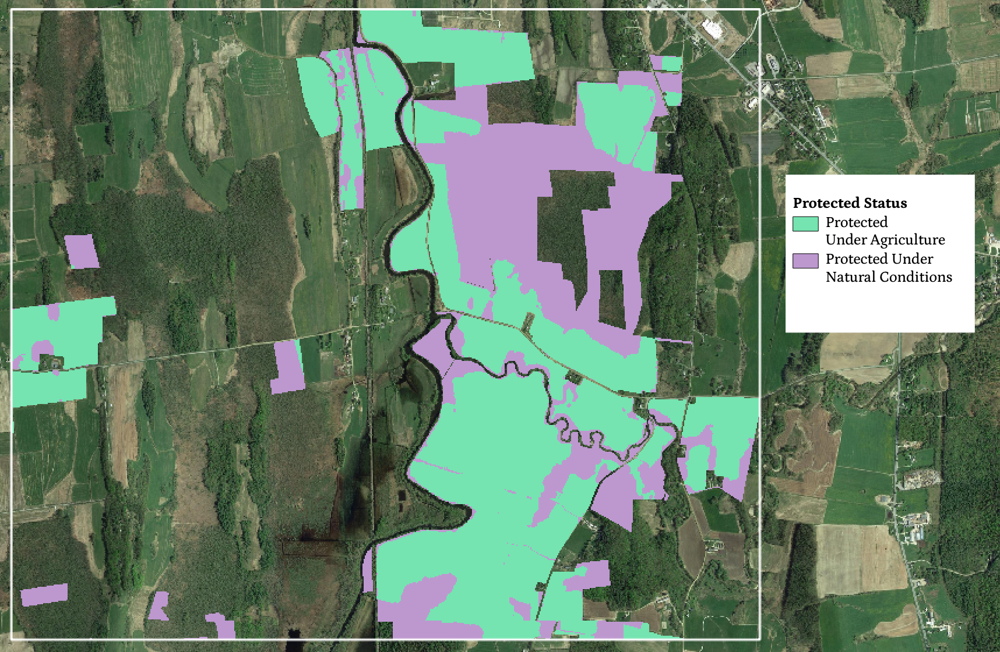

To start, we add the reclassified landcover raster to a three-class raster of protected lands (0: not protected, 100: protected under agriculture, and 200: protected under natural conditions) in order to get classes representing the different combinations of land cover on swamp soils and their protected statuses.

| |0 - Not Protected|100 - Protected Ag|200 - Protected Natural|
|---|---|---|---|
|**0 - Not Swamp**|0|100|200|
|**1 - Tree Canopy**|1|101|201|
|**2 - Grassland/Shrubland**|2|102|202|
|**3 - Agricultural Land**|3|103|203|
|**4 - Water**|4|104|204|
|**5 - Developed/Other**|5|105|205|

From there, we can measure the areas of certain land cover types on swamp soils that are unprotected, protected under agriculture, and protected under natural conditions. In the following chart, we can see that tree cover is far and away the dominant land cover type on swamp soils, followed by grassland/shrubland and agriculture. Of the tree cover, most is unprotected, at nearly 800 acres. Around 250 acres of swamp forest are protected under natural conditions. Of the grassland/shrubland on swamp soils, similar proportions are (un)protected, but there is less area. Agricultural land is likely to be protected under agriculture or not protected, while water and developed/other classes occupy a negligible amount of the swamp soil areas.

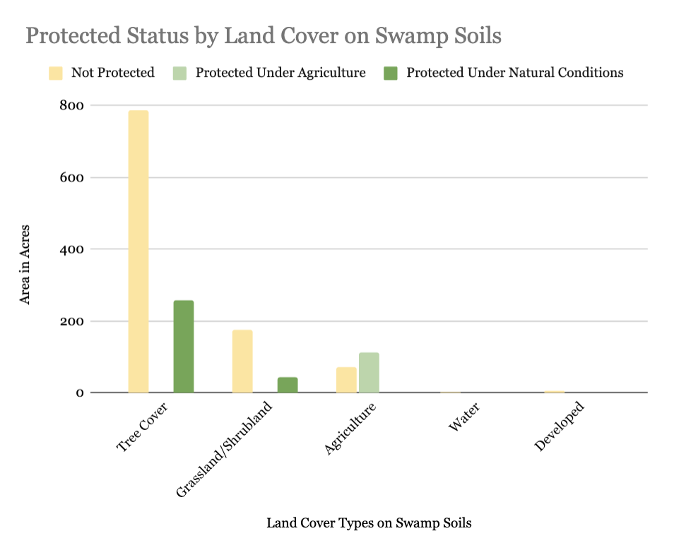

### 2. &emsp; What if we protected habitat blocks and riparian corridors?

Here is a map of habitat blocks and riparian corridors, and the areas outside of vs. within both. These areas provide the basis for a potential system of conservation which could prove more comprehensive than the current patchwork of protected lands.

##### Habitat Blocks and Riparian Corridors Map

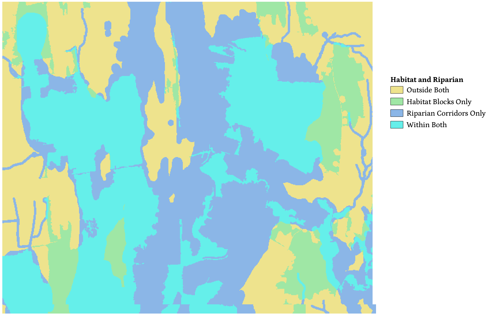

Next, we carry out a similar analysis, but we ask how much of the swamp would be protected if our conservation system was based on habitat blocks and riparian corridors. We combine the habitat blocks and riparian corridors into a four-class raster (0: neither, 1: habitat block only, 2: riparian corridor only, 3: both). Then we add a multiple of this raster to the landcover on swamp soils, yielding a set of classes representing all the possible combinations.

| |0 - Neither|10 - Habitat Blocks|20 - Riparian Corridors|30 - Within Both|
|---|---|---|---|---|
|**0 - Not Swamp**|0|10|20|30|
|**1 - Tree Canopy**|1|11|21|31|
|**2 - Grassland/Shrubland**|2|12|22|32|
|**3 - Agricultural Land**|3|13|23|33|
|**4 - Water**|4|14|24|34|
|**5 - Developed/Other**|5|15|25|35|

Taking the area of each land cover type on swamp soils, we can identify the acreage that falls within both habitat blocks and riparian corridors, one or the other, or neither. In the chart below, we can see that almost all forested areas on swamp soils are within both habitat blocks and riparian corridors, at about 1000 acres, while other land cover types are likelier to fall within riparian corridors but possibly not habitat blocks.

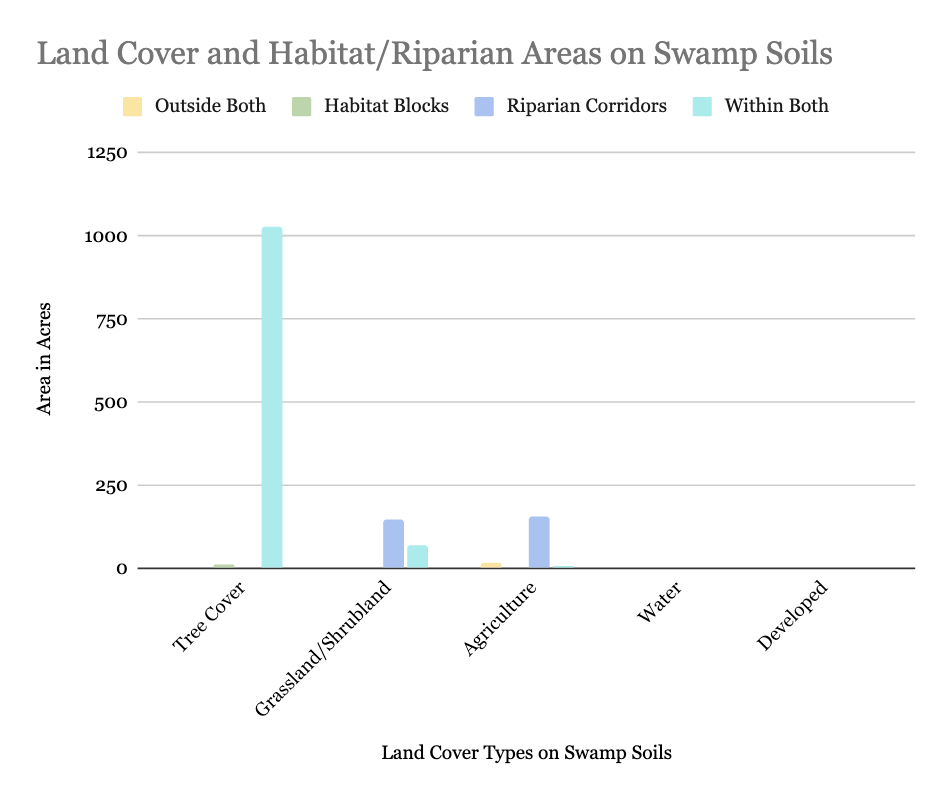

If we turn to a side-by-side comparison of the current conservation system and a potential future system based on habitat blocks and riparian corridors, we can get a better understanding of how particular land cover types fare under each method. In the three charts below, we can get a more granular understanding of tree cover on swamp soils, grassland/shrubland, and agricultural land on swamp soils. In each chart, the first three bars represent the current system (areas not protected, protected under agriculture, and protected under natural conditions) while the last four represent the potential system (areas outside vs. within habitat blocks and riparian corridors).

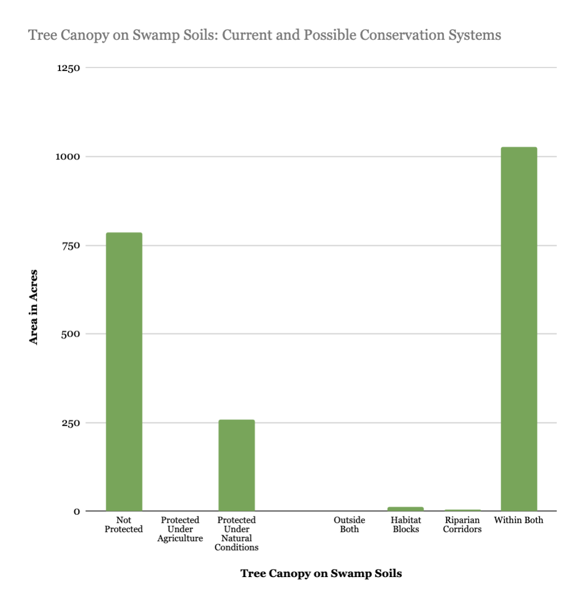

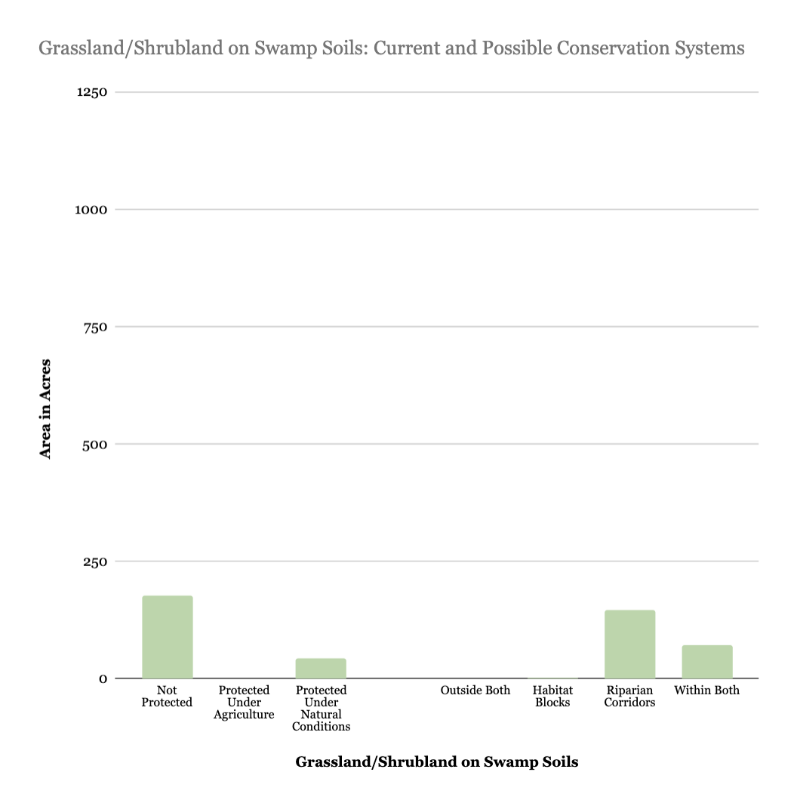

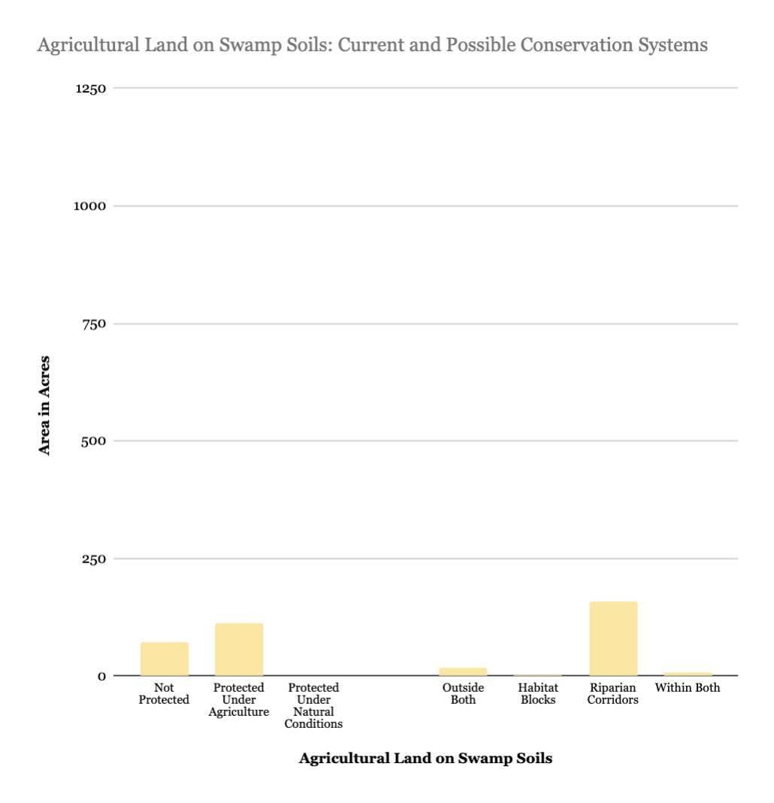

### 3. &ensp; How do natural swamps fare?

Under the current pattern of conservation, 23.9% of natural swamps are protected under natural conditions, as shown in the following pie chart. The remaining 76.1% are not protected, and agricultural protection is negligible in areas of natural, non-agricultural swamp.

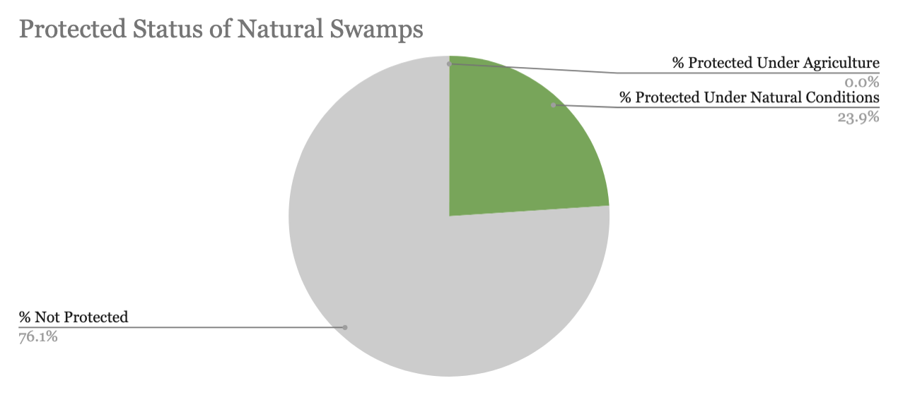

Looking at natural swamps in the context of habitat blocks and riparian corridors, 86.8% of natural swamp area is within both, 11.9% is only in a riparian corridor, and 1.2% is within habitat blocks but not riparian corridors. Virtually no natural swamp is outside of both habitat blocks and riparian corridors, so if we took these as areas to protect, it would bode well for the swamp.

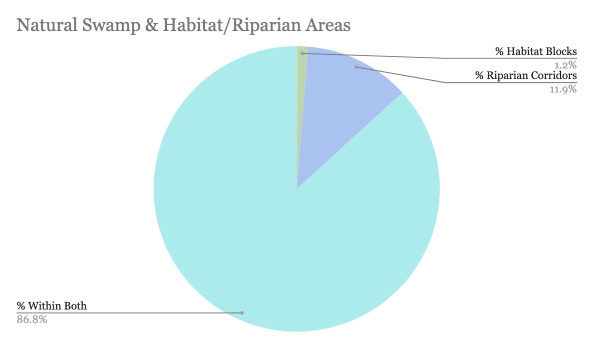

### 4. &ensp; State Significance

The state of Vermont designates some natural community areas as significant, but not others. Here, we have a map showing the overlap and non-overlap of state significant communities and swamp soils in the region of interest. State significant areas are shown in light purple, while swamp soils are mapped with a white line pattern:

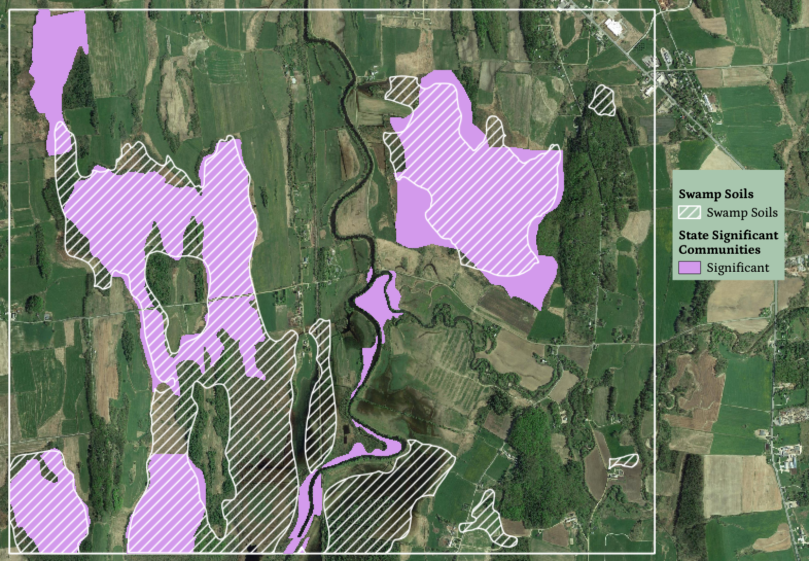

Carrying out area calculations for each land cover type, we can then see what percent of each is identified as state significant natural communities. Tree cover on swamp soils is likeliest to be deemed significant, followed by grassland and shrubland. Some developed land is considered significant, because we buffered around buildings and roads to a distance where they overlap with state significant areas. 

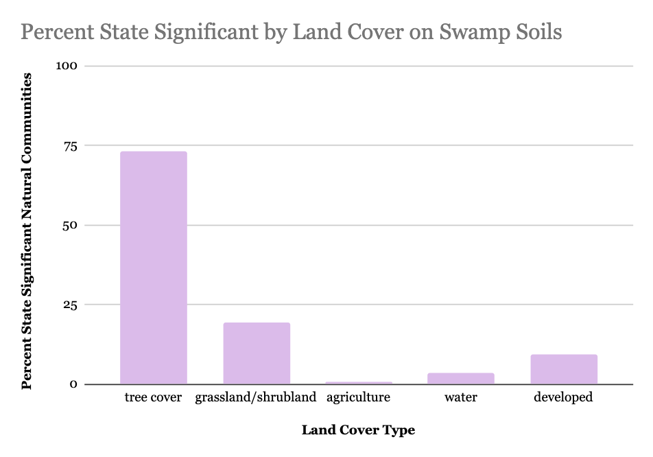
