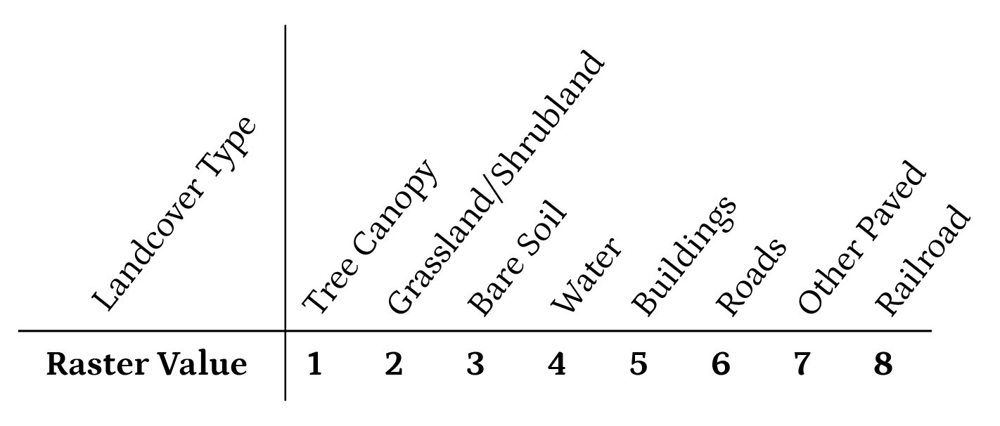
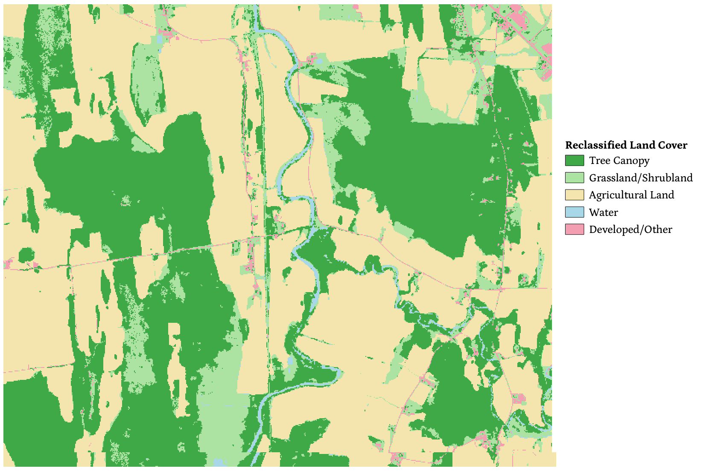
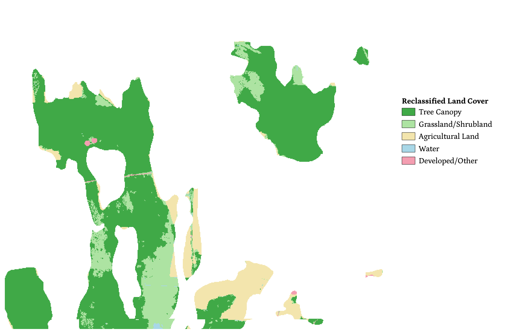

# Swamp: Current Conditions

Here, we isolate and map the land cover types of interest on swamp soils. We do so by reclassifying landcover to focus on natural swamps (with and without trees), agricultural land, waters, and developed land (including buffers around buildings and roads). The three principal steps are (1) reclassifying the landcover, including by burning in external data on agricultural areas; (2) making buffers around buildings and roads and assigning these areas to a developed/other landcover class; and (3) narrowing the analysis down to areas on swamp soils.
  
Here is a look at the final result this process arrives at, a map of the current conditions of swamps in a test region. As we can see, most of the landcover on swamp soils remains trees (dark green). Sizable portions have been cleared or degraded, and are now grassland or shrubland (light green), while large chunks near Otter Creek are in agricultural use (light tan), and some small areas are paved, bare, or developed (pink).

##### Swamp Current Conditions Map

### *Data Prep*
See the Google Earth Engine code,
[here](https://code.earthengine.google.com/817a1d84209bc94c67b73347357faae6), to process and download these inputs:

|Feature|Raster Name|
|---|---|
|Land Cover|*'lc.tif'*|
|NRCS Swamp Soil Series|*'swampsoil.tif'*|
|100-Meter Buffered Buildings|*'imageBB_inv.tif'*|
|Fragmenting Roads|*'rdsFragmenting.tif'*|
|Agricultural Land|*'agImage.tif'*|

### 1. Land Cover  

We begin with a high-resolution landcover **raster** (geographic image), which the Vermont Center for Geographic Information (VCGI) created using 2013-2017 LiDAR and aerial imagery from 2016. The landcover consists of eight classes:

We begin by reclassifying the landcover types, isolating (1) tree canopy, (2) grassland/shrubland, (3) agricultural land, (4) water, and (5) developed/other land cover. To bring in the agricultural lands (which are not included in the landcover raster), we burn a fixed value (3) into the landcover wherever there is farmland according to a binary raster, also from the VCGI.

Of these land cover types, we treat tree canopy and grassland/shrubland as 'natural' swamps, although grassland/shrubland swamps may be degraded or represent possible areas of future swamp restoration.

For the purposes of this analysis, we treat bare soil, buildings, roads, and other paved surfaces as developed/other land cover, and these are reclassified as such. Railroads we reclassify to include with grassland and shrubland, since railroads can be a non-fragmenting element in the natural environment.

##### Reclassified Land Cover Map

### 2.  Buffered Buildings and Roads  

Once we have reclassified the landcover, we modify it to account for the fact that areas in the direct vicinity of buildings are generally not in a natural state. To do so, we buffer buildings by 100 feet and reclassify the landcover within those buffers to our developed/other class (5).

Additionally, the VCGI landcover dataset includes tree canopy overhanging roads, but we want to consider the fragmenting effects of certain road types (federal and state highways and class 3 roads). To do this, we buffer fragmenting roads by three meters and, again, reclassify the landcover within those buffers to the developed/other class.

The result of buffering buildings and roads is the following map, where we can see that the developed/other class (in pink) takes up more of the landscape. However, we will see in the next section that much of the buffered developed area is outside of areas of swamp soils.

##### Buffering Buildings and Roads

### 3. Narrow by Swamp Soils

Then we isolate lands located on soil series associated with swamps, as identified by the Natural Resources Conservation Service (NRCS). This involves listing the full set of soil series that generally indicate swamps (e.g., Adrian soils, Au Gres, Biddeford, Binghamville, Birdsall, Brayton, and so on). We reclassify areas that are not on swamp soils to a non-swamp class with the raster value 0 (white areas in the map below).

##### Map of Reclassified Land Cover on Swamp Soils

