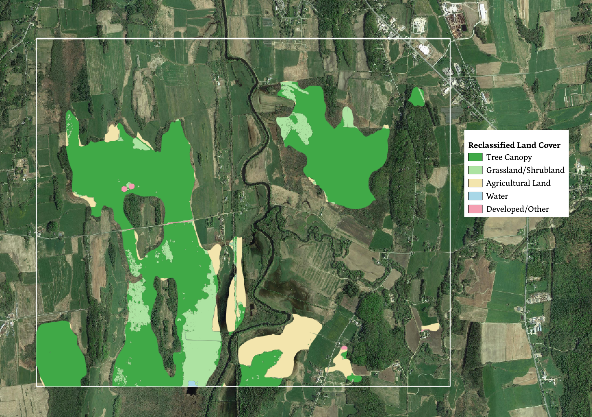
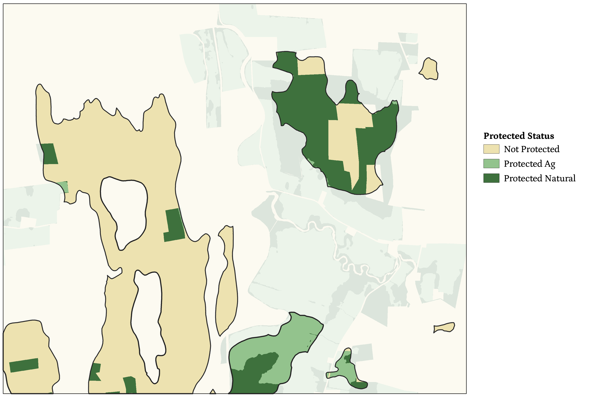
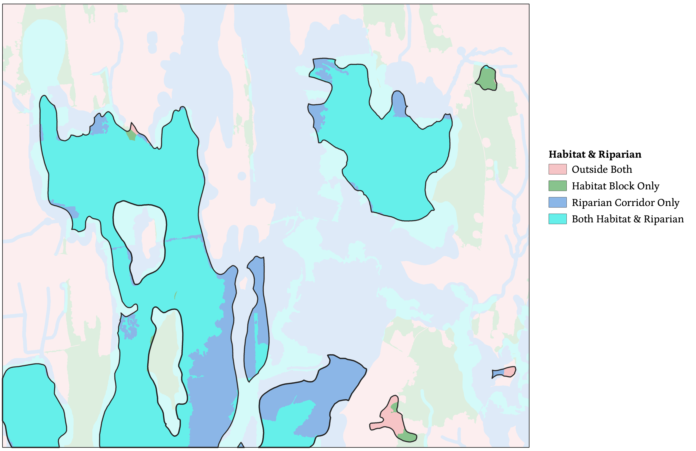
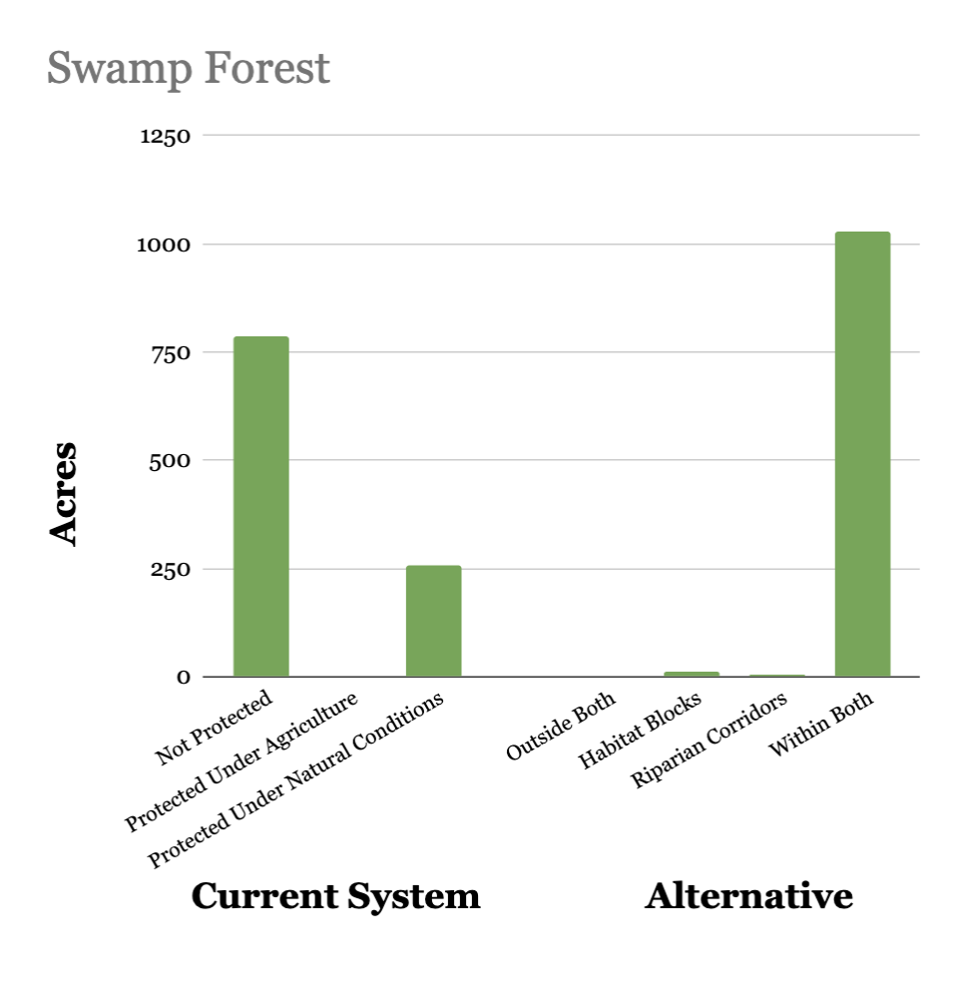
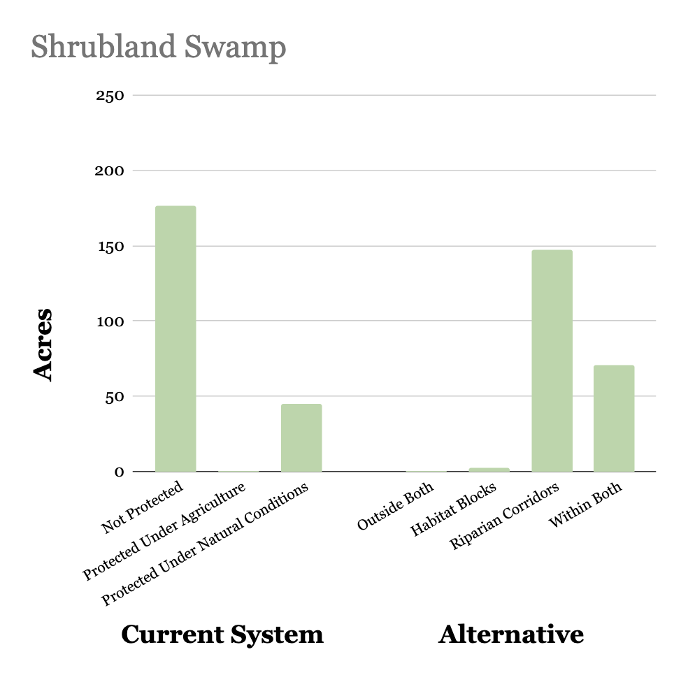

# Swamps
##### Background

- Swamps are inland, freshwater wetlands that are predominantly forested or covered with lower-growing shrub plants.

- In some places, past areas of swamp have been cleared and converted to crops or hayfields.

- Parts of the swamp have been degraded from healthy wet forest to a state of lower biomass and biodiversity. Possibly due to changes in hydrology introduced by ditches and berms.

- Conservation should aim to preserve existing large blocks of swamp, especially in areas with greater diversity and rarer soils, species, or natural community types. Restoration of degraded and converted swamps should also be a priority.

&ensp;

##### Present Conditions

- Most of the swamp in this test region remains forested.

- Some areas near Otter Creek have been converted to agriculture.

- Swaths south of Morse Road are occupied by grassland or shrubland, drained into the creek by artificial ditches.

&ensp;

##### Conservation System

- A majority of swamp-soil area is not protected, as shown in this map.

- East of Otter Creek, there are larger conserved areas, some of them protected under agriculture. However, coverage is less than ideal.

&ensp;

##### An Alternative Model

- If we instead took habitat blocks and riparian corridors as the basis for conservation, most areas of swamp soil would fall within one or both. There are only isolated pockets falling outside of riparian corridors or outside both.

- Areas of grassland/shrubland swamp and areas converted to agriculture tend to fall within riparian zones, but outside habitat blocks. Swamp forest is almost all within both riparian corridors and habitat blocks.

&ensp;

##### Protecting and Restoring Swamp Forest
|||
|---|---|

- Protection of swamp forest would become nearly universal under the alternative system.

- Most shrubland swamp is not currently protected, but falls within riparian corridors or habitat blocks, and could be targeted for restoration to a healthy forest state.
